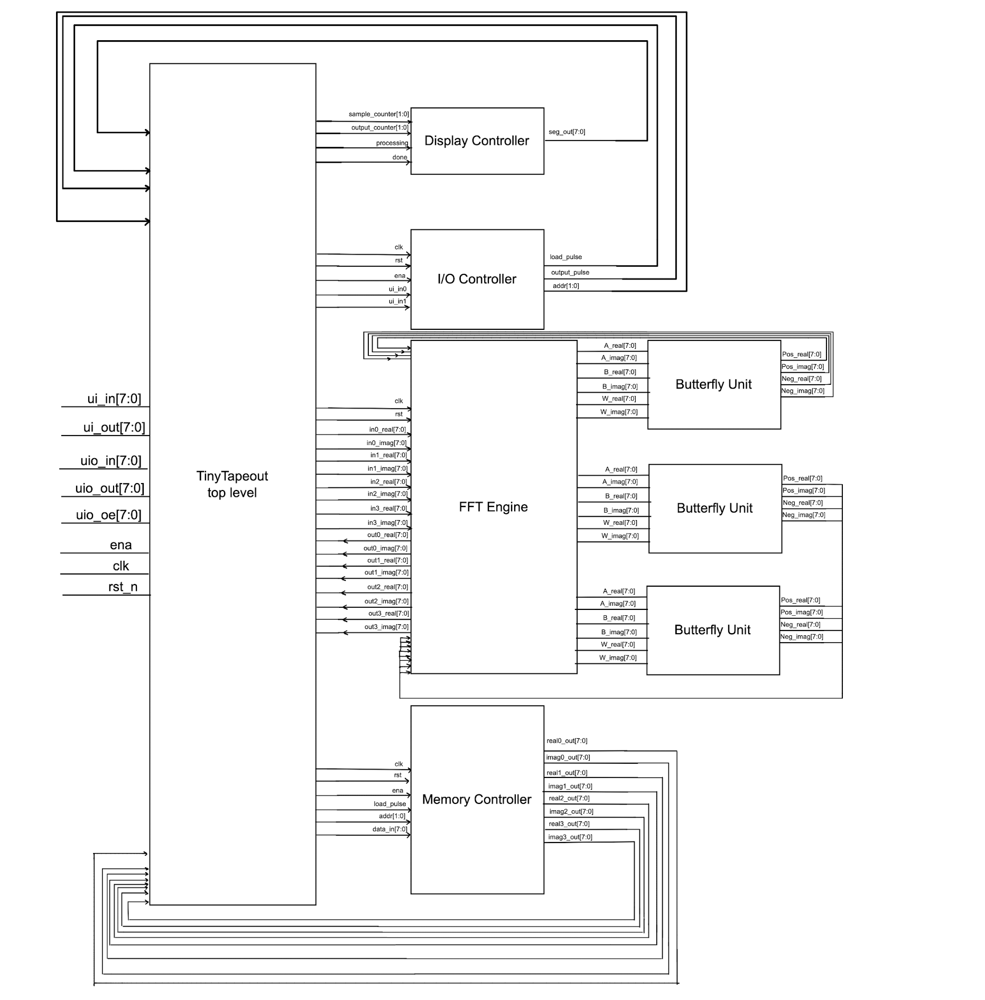

## How it works

This project implements a 4-point, 8-bit fixed-point Fast Fourier Transform (FFT) engine using SystemVerilog, designed to be deployed on a TinyTapeout-compatible chip and evaluated through a PCB. The FFT engine is based on a radix-2 decimation-in-time (DIT) architecture, structured in two stages using butterfly modules and twiddle factor multiplication to compute the frequency-domain representation of four complex time-domain samples.

The system interfaces with users through a simple control scheme consisting of 8 input switches, bidirectional I/O pins, and a single-digit 7-segment display. Switches 0 and 1 control the data flow into and out of the system, respectively.

### System Architecture

The architecture consists of several key components:

1. **Memory Controller**: Manages sequential loading of 4 complex input samples via bidirectional data bus
2. **FFT Engine Core**: Implements 4-point FFT algorithm using butterfly computation units
3. **I/O Controller**: Manages input switches and output sequencing control
4. **Display Controller**: Drives 7-segment display showing operation status
5. **Butterfly Computation Units**: computes results

### Processing Pipeline

The FFT computation follows a two-stage butterfly architecture:

**Stage 1**: 
- Butterfly operation on input pairs (0,2) and (1,3)
- Uses twiddle factor W₀ = 1 (no multiplication needed)

**Stage 2**: 
- Final butterfly operations with twiddle factor multiplication
- Uses W₁ = -j for appropriate frequency bin calculations
- Outputs 4 complex frequency domain results

### Timing and Data Flow

- **Processing Latency**: Exactly 20 clock cycles from last input to first valid output
- **Clock Frequency**: 50 MHz operation
- **Data Format**: 8-bit complex samples (full 8-bit real and imaginary components)
- **Sample Storage**: Internal memory holds samples until FFT computation is triggered

### Control Interface

The system uses a simple 2-button interface:

**Switch 0 (Load Control)**:
1. First toggle: Load sample 1
2. Second toggle: Load sample 2  
3. Third toggle: Load sample 3
4. Fourth toggle: Load sample 4

**Switch 1 (Output Control)**:
1. First toggle: Output frequency bin 1
2. Second toggle: Output frequency bin 2
3. Third toggle: Output frequency bin 3
4. Fourth toggle: Output frequency bin 4

### 7-Segment Display Status

The display provides real-time operation feedback:
- **1-4**: Currently inputting sample n
- **C**: Computing FFT (processing phase)
- **5-8**: Currently outputting frequency bin n-4

**[FFT Engine INITIAL Design Document, NOT UP TO DATE USE DOCS IN REPO INSTEAD](https://docs.google.com/document/d/13jseVi1bMsw91EZKD1t0jHazFGBT2K84RPKfIGI_DeA/edit?tab=t.0#heading=h.6vw8kxunlpo9)**

## How to Validate/test (Post Silicon)

### Hardware Setup

**Required Components**:
- 7-segment display connected to `uo_out[7:0]`
- Input switches connected to `ui_in[1:0]` 
- Bidirectional data interface on `uio[7:0]`

### Test Procedure

#### 1. Input Phase
1. **Load Sample 1**: Toggle Switch 0, apply first 8-bit complex sample to `uio[7:0]`
2. **Load Sample 2**: Toggle Switch 0 again, apply second sample
3. **Load Sample 3**: Toggle Switch 0 again, apply third sample  
4. **Load Sample 4**: Toggle Switch 0 again, apply fourth sample

*Display shows "1", "2", "3", "4" during respective loading phases*

#### 2. Processing Phase
- FFT computation begins automatically after last sample loaded
- No user interaction required

#### 3. Output Phase  
1. **Read Bin 1**: Toggle Switch 1, read first frequency bin from `uio[7:0]`
2. **Read Bin 2**: Toggle Switch 1 again, read second frequency bin
3. **Read Bin 3**: Toggle Switch 1 again, read third frequency bin
4. **Read Bin 4**: Toggle Switch 1 again, read fourth frequency bin

*Display shows "5", "6", "7", "8" during respective output phases*

### Data Format

**Input Samples**: Each 8-bit word represents one complex sample
- Real and imaginary components are full 8-bit signed values
- Input range: -128 to +127 for both real and imaginary parts

**Output Results**: Each 8-bit word represents one frequency bin  
- Contains processed FFT result for that frequency

## External hardware
- **7-segment display**: Single digit display for status indication
- **Input switches**: 2 momentary or toggle switches for control
- **Data interface**: 8-bit bidirectional connection for samples/results
- **Reset button**: Connected to `rst_n` for system initialization  

**Pin Connections**:
- `ui_in[0]`: Load/Input control switch
- `ui_in[1]`: Output/Read control switch  
- `uo_out[7:0]`: 7-segment display
- `uio[7:0]`: Bidirectional data bus (input samples / output results)
- `rst_n`: Active-low reset
- `clk`: 50 MHz system clock